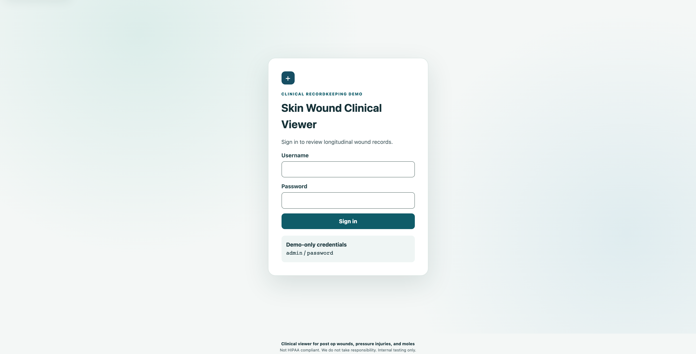
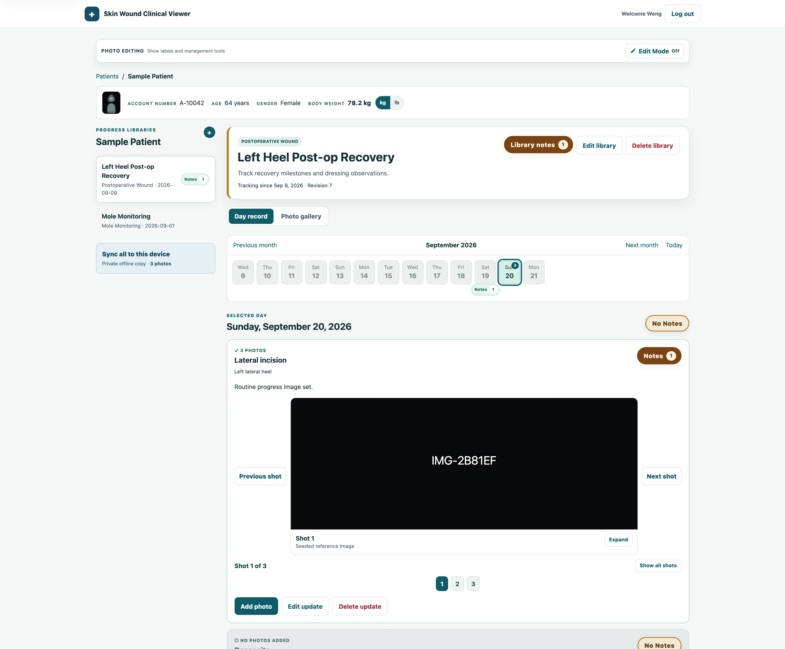
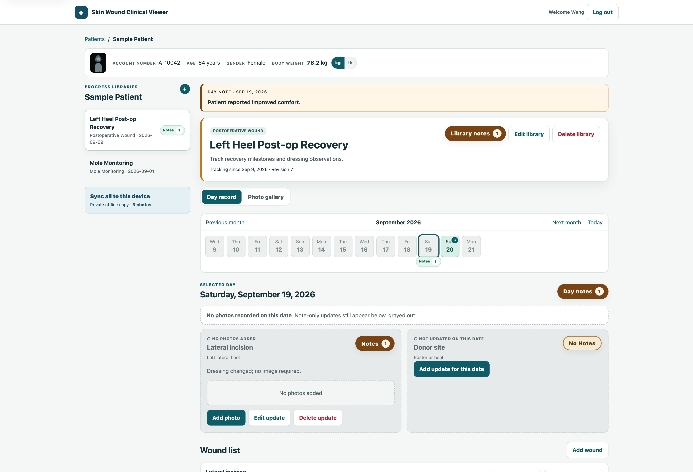
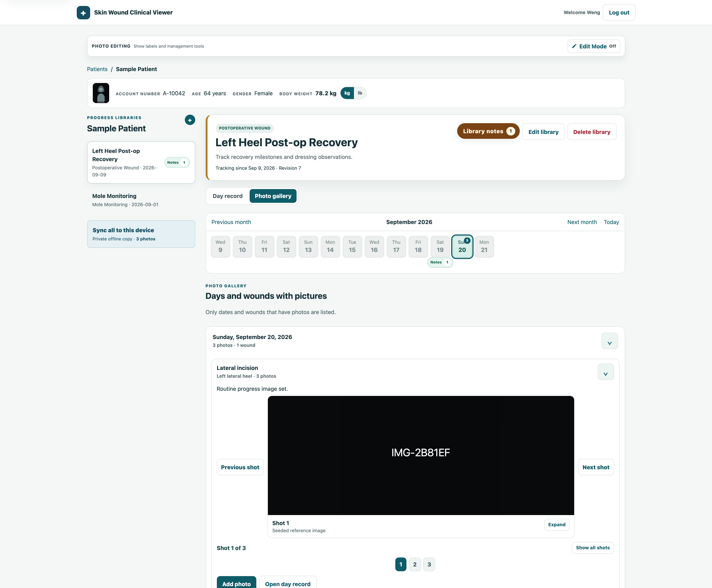
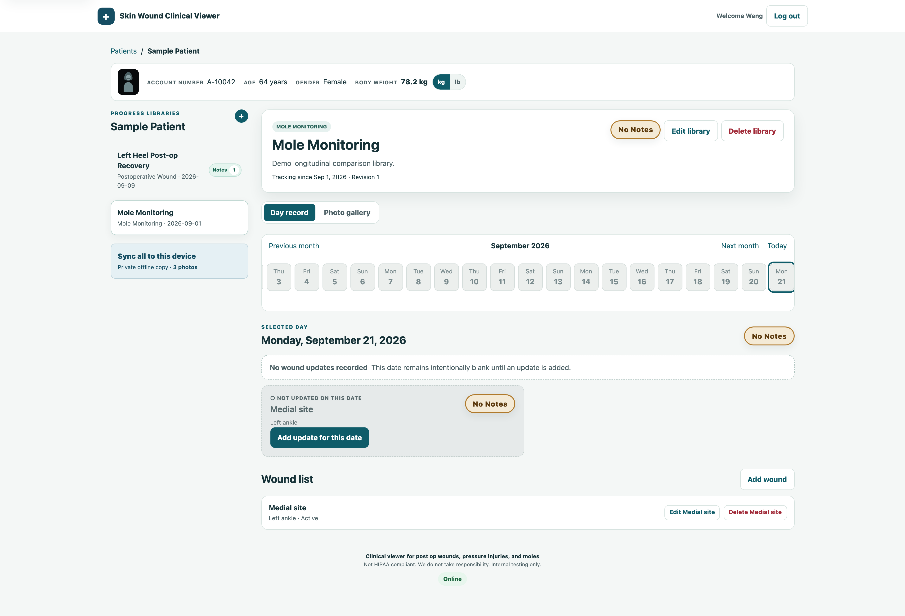

# Skin Wound Clinical Viewer


<a target="_blank" href="https://github.com/Siphon880gh" rel="nofollow"></a>
<a target="_blank" href="https://www.linkedin.com/in/weng-fung/" rel="nofollow"></a>
<a target="_blank" href="https://www.youtube.com/@WengTeachesCode/" rel="nofollow"></a>

By Weng (Weng Fei Fung)

Clinical viewer for post op wounds, pressure injuries, and moles.

**Not HIPAA compliant.** We do not take responsibility. Internal testing only.

A self-contained, file-backed wound progress recordkeeping demo. The application
uses one PHP entry file with no database, framework, package install, CDN, or
remote service.

## What it can do

Screens below use the seeded **Sample Patient** record.

### Sign in



Demo credentials are labeled on the card: `admin` / `password`.

### Choose a patient

Each card shows diagnosis, account number, age, gender, and weight. Open a
record to enter that patient's progress libraries.

### Review a day's wound record



A progress library has a month timeline, wound cards, and angle photos for the
selected date. Dates with photos are marked. **Sync all to this device** stores
a private offline copy of the patient snapshot and every full-size photo.

### See dates that were not fully updated



A date can carry a day note, a note-only wound update, and a wound that was not
updated. Missing wounds stay visible as muted cards instead of disappearing.

### Browse photos over time



Photo gallery lists only days and wounds that have pictures, so you can compare
shots without paging through empty dates.

### Use the same layout for other library types



Postoperative wounds, pressure injuries, mole monitoring, and custom types share
one workspace. Empty days stay blank until an update is added.

## Run

```bash
php -d upload_max_filesize=15M -d post_max_size=16M -S localhost:8000
```

The upload flags match the app's 15 MB photo limit; PHP's default is 2 MB.
On PHP-FPM hosts the bundled `.user.ini` sets the same limits.

Open <http://localhost:8000>, then sign in with the visible demo credentials:

* Username: `admin`
* Password: `password`

On first run the app creates `storage/`, exactly one non-identifying sample
patient, two progress libraries, example notes and black serial-number photo
placeholders. Set `POSTOP_STORAGE_DIR` to use a different writable data folder,
which is useful for isolated testing.

## Offline use

Use **Sync all to this device** from the patient workspace and accept the privacy
warning. This deliberately downloads the complete patient snapshot and every
full-size photo. Browser Cache Storage holds that replica; IndexedDB holds only
sync metadata and the pending-change outbox. **Clear device copy** removes the
browser copy without changing server records. Logout asks the browser to clear
the local cache and storage.

An app control is always available below the footer. A browser tab shows **App ·
Install/Open** while installation status is unknown. It uses the browser's native
install prompt when one is available; otherwise it explains how to install or
open the app on the current platform. A positive installed-app result from a
supported browser changes the controls to **App · Open · Uninstall**. The
installed PWA itself shows only **App · Uninstall**.

Apple browsers do not reliably report whether the app is installed elsewhere on
the device, so they keep the honest **Install/Open** fallback in a browser tab.
On iPhone and iPad, the instructions direct the user to the Home Screen icon or
to **Share → Add to Home Screen**. On Mac, Safari uses **File → Add to Dock**.
An ordinary web URL cannot force an installed PWA to open, so **Open** explains
where to launch it when no supported launch mechanism exists. **Uninstall**
explains the device or browser removal steps; it does not misrepresent clearing
caches or unregistering a service worker as removing the installed app. Offline
patient data remains under the separate **Clear device copy** control.

Installing adds the viewer to the device but does not download records; use Sync
all to this device for that separate, explicit action.

Production use requires HTTPS. Service workers are also supported on localhost
for development. This is a recordkeeping demo for internal testing only, not a
diagnostic tool, emergency service, certified EHR, or HIPAA-compliant system.

## Future Plan

Sample Patient will contain AI generated photos of a post op wound with the words "AI Generated / Not real patient"
