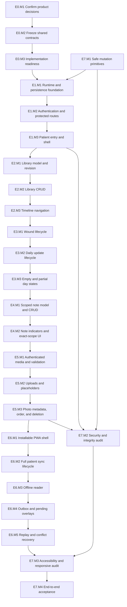

# Dependency graph prompt

Use this prompt at the beginning of every orchestration pass.

## Prompt

You are coordinating implementation of the Postop wound-progress gallery.
Read `PLAN.md`, `PRODUCT_PLAN.md`, `.agents/state.json`, and `loops/README.md`.
Validate the state using `loops/state.schema.json`. Reconcile state against the
working tree and test evidence; source files alone do not prove completion.

Select exactly one dependency-ready milestone from the graph below. Prefer the
lowest numbered milestone, except that applicable E7 guardrails must be built
with the feature that first needs them. If a milestone is already `in_progress`,
resume it before selecting another. Never start a node whose prerequisites have
not passed.

E7.M1 is initiated with E1 and remains a cross-cutting prerequisite. Re-run
E7 checks in every later milestone rather than postponing safety.

For the selected milestone, load its `loops/epics/E*.md` prompt. Change its
state to `in_progress`, set `current_epic_id` and `current_milestone_id`, and
write `last_updated_iso`. Decompose only the selected milestone into tasks that
each have a concrete deliverable and an automated verification command. Execute
each task through `loops/task-loop.md`. Then use `loops/milestone-loop.md`.

If no node is ready, explain the exact unmet dependency in state. Pause only if
human verification is required or a feature has accumulated five failed
attempts. Otherwise select the next ready node and continue without asking for
permission.

